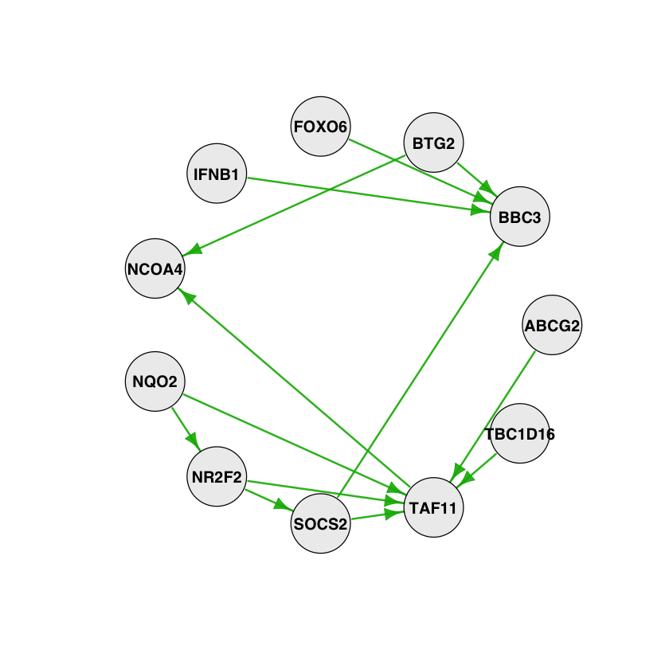
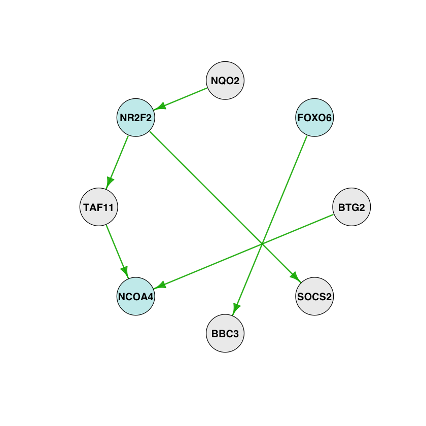
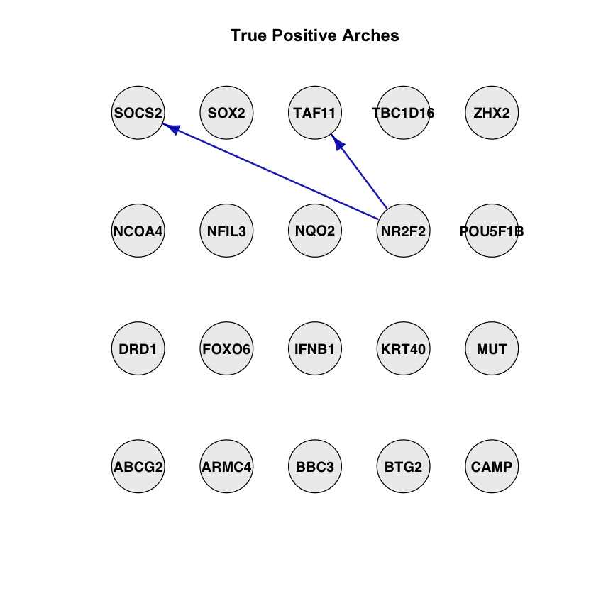
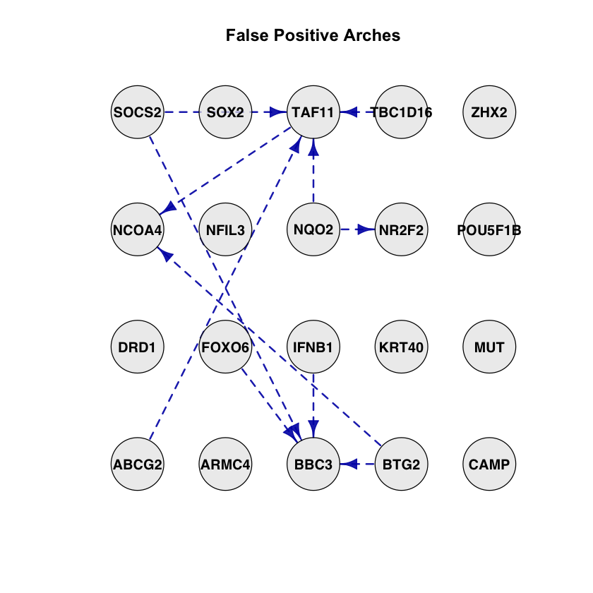
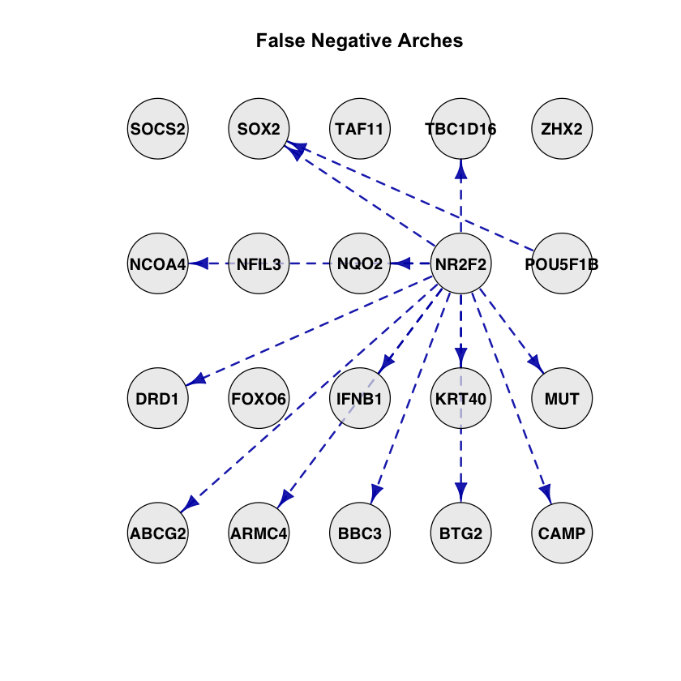
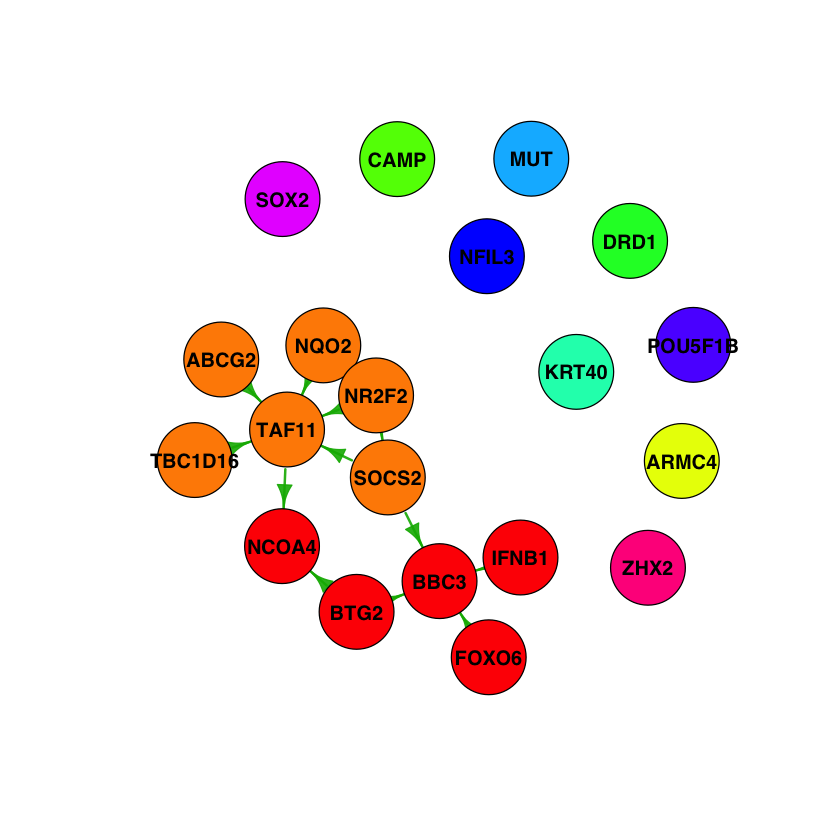
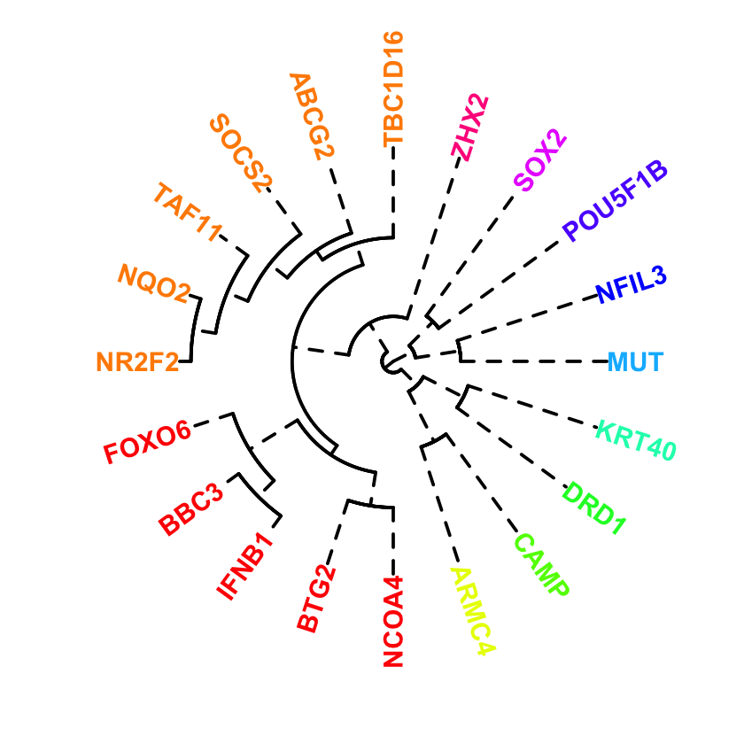

# gnlearn
Genetic Network Learning

## Structure Learning Algorithms

### Constraint-Based
* Skeleton -> bnlearn & pcalg
* PC (the stable version) -> bnlearn & pcalg
* FCI -> pcalg
* RFCI -> pcalg
* FCI+ -> pcalg
* Grow-Shrink (GS) -> bnlearn
* Incremental Association Markov Blanket (IAMB) -> bnlearn
* Fast Incremental Association (Fast-IAMB) -> bnlearn
* Interleaved Incremental Association (Inter-IAMB) -> bnlearn
* Incremental Association with FDR Correction (IAMB-FDR) -> bnlearn
* Max-Min Parents & Children (MMPC) -> bnlearn
* Semi-Interleaved Hiton-PC (SI-HITON-PC) -> bnlearn
* Hybrid Parents & Children (HPC) -> bnlearn
* Chow-Liu -> bnlearn
* ARACNE -> bnlearn

### Score-Based
* Hill Climbing (HC) -> bnlearn
* Tabu Search (Tabu) -> bnlearn
* Greedy-Equivalent-Search (GES) -> pcalg
* Linear NO-TEARS -> own reimplementation in R

### Hybrid (Skeleton/Constraint-Based + Score-Based)
* General 2-Phase Restricted Maximization (RSMAX2) -> bnlearn
* Max-Min Hill Climbing (MMHC) -> bnlearn
* Hybrid HPC (H2PC) -> bnlearn
* Adaptively Restricted GES (ARGES) -> pcalg

### Graphical Lasso
* GLASSO -> glasso

### Restricted Structural Equation Models
* LINGAM -> pcalg

### Graphical Continuous Lyapunov Models
* GCLM -> gclm

### NODAG
* NODAG -> https://github.com/gherardovarando/nodag

## Install *gnlearn* R Package

```R
if (!requireNamespace('devtools', quietly=TRUE))
    install.packages('devtools')
devtools::install_github('rlebron-bioinfo/gnlearn')
```

## Quick Start


```R
library(gnlearn)
```


```R
list.datasets(sp.common='human', cell.identity='breast cancer')
```


<table>
<caption>A data.frame: 4 × 11</caption>
<thead>
	<tr><th></th><th scope=col>download.code</th><th scope=col>sp.scientific</th><th scope=col>sp.common</th><th scope=col>bio.layer</th><th scope=col>seq.protocol</th><th scope=col>cell.identity</th><th scope=col>n.genes</th><th scope=col>n.cells</th><th scope=col>ref.authors</th><th scope=col>ref.doi</th><th scope=col>raw.dataset</th></tr>
	<tr><th></th><th scope=col>&lt;int&gt;</th><th scope=col>&lt;chr&gt;</th><th scope=col>&lt;chr&gt;</th><th scope=col>&lt;chr&gt;</th><th scope=col>&lt;chr&gt;</th><th scope=col>&lt;chr&gt;</th><th scope=col>&lt;int&gt;</th><th scope=col>&lt;int&gt;</th><th scope=col>&lt;chr&gt;</th><th scope=col>&lt;chr&gt;</th><th scope=col>&lt;chr&gt;</th></tr>
</thead>
<tbody>
	<tr><th scope=row>94</th><td>94</td><td>Homo sapiens</td><td>Human</td><td>Transcription</td><td>10x Chromium</td><td>Breast Cancer Cell Line (MCF7)</td><td>535</td><td>4367</td><td>Ben-David et al. 2018</td><td>10.1038/s41586-018-0409-3</td><td>https://github.com/rlebron-bioinfo/gnlearn-datasets/raw/master/Homo_sapiens/Transcription/Ben-David2018/breast_cancer_MCF7_rep1.tsv.gz</td></tr>
	<tr><th scope=row>95</th><td>95</td><td>Homo sapiens</td><td>Human</td><td>Transcription</td><td>10x Chromium</td><td>Breast Cancer Cell Line (MCF7)</td><td>543</td><td>4806</td><td>Ben-David et al. 2018</td><td>10.1038/s41586-018-0409-3</td><td>https://github.com/rlebron-bioinfo/gnlearn-datasets/raw/master/Homo_sapiens/Transcription/Ben-David2018/breast_cancer_MCF7_rep2.tsv.gz</td></tr>
	<tr><th scope=row>96</th><td>96</td><td>Homo sapiens</td><td>Human</td><td>Transcription</td><td>10x Chromium</td><td>Breast Cancer Cell Line (MCF7)</td><td>523</td><td>7370</td><td>Ben-David et al. 2018</td><td>10.1038/s41586-018-0409-3</td><td>https://github.com/rlebron-bioinfo/gnlearn-datasets/raw/master/Homo_sapiens/Transcription/Ben-David2018/breast_cancer_MCF7_rep3.tsv.gz</td></tr>
	<tr><th scope=row>97</th><td>97</td><td>Homo sapiens</td><td>Human</td><td>Transcription</td><td>10x Chromium</td><td>Breast Cancer Cell Line (MCF7)</td><td>520</td><td>5600</td><td>Ben-David et al. 2018</td><td>10.1038/s41586-018-0409-3</td><td>https://github.com/rlebron-bioinfo/gnlearn-datasets/raw/master/Homo_sapiens/Transcription/Ben-David2018/breast_cancer_MCF7_rep4.tsv.gz</td></tr>
</tbody>
</table>


```R
df <- download.dataset(94, log=TRUE)
dim(df)
```


<ol><li>4367</li><li>535</li></ol>


```R
sel.df <- select.genes(df, max.genes=20, cor.threshold=0.6)
dim(sel.df)
```


<ol><li>4367</li><li>20</li></ol>


```R
g <- boot.pc(sel.df, R=100, cluster=4, to='igraph')
g
```


    IGRAPH 45b8d27 DNW- 20 13 --
    + attr: name (v/c), weight (e/n)
    + edges from 45b8d27 (vertex names):
     [1] ABCG2  ->TAF11 BTG2   ->BBC3  BTG2   ->NCOA4 FOXO6  ->BBC3  IFNB1  ->BBC3
     [6] NQO2   ->NR2F2 NQO2   ->TAF11 NR2F2  ->SOCS2 NR2F2  ->TAF11 SOCS2  ->BBC3
    [11] SOCS2  ->TAF11 TAF11  ->NCOA4 TBC1D16->TAF11


```R
graph.plot(g, isolated.genes=FALSE, layout='circle')
```

<br>


```R
list.genesets(sp.common='human')
```


<table>
<caption>A data.frame: 3 × 5</caption>
<thead>
	<tr><th></th><th scope=col>download.code</th><th scope=col>sp.scientific</th><th scope=col>sp.common</th><th scope=col>dataset</th><th scope=col>url</th></tr>
	<tr><th></th><th scope=col>&lt;int&gt;</th><th scope=col>&lt;chr&gt;</th><th scope=col>&lt;chr&gt;</th><th scope=col>&lt;chr&gt;</th><th scope=col>&lt;chr&gt;</th></tr>
</thead>
<tbody>
	<tr><th scope=row>4</th><td>4</td><td>Homo sapiens</td><td>Human</td><td>Genes                 </td><td>https://raw.githubusercontent.com/rlebron-bioinfo/gnlearn-datasets/master/Homo_sapiens/Genes/human_genes.txt                 </td></tr>
	<tr><th scope=row>5</th><td>5</td><td>Homo sapiens</td><td>Human</td><td>TF-Target Interactions</td><td>https://raw.githubusercontent.com/rlebron-bioinfo/gnlearn-datasets/master/Homo_sapiens/Genes/human_tf-target_interactions.txt</td></tr>
	<tr><th scope=row>6</th><td>6</td><td>Homo sapiens</td><td>Human</td><td>Drug-Gene Interactions</td><td>https://raw.githubusercontent.com/rlebron-bioinfo/gnlearn-datasets/master/Homo_sapiens/Genes/human_drug-gene_interactions.txt</td></tr>
</tbody>
</table>


```R
genes <- download.geneset(4)
head(genes)
```


<table>
<caption>A data.frame: 6 × 18</caption>
<thead>
	<tr><th></th><th scope=col>name</th><th scope=col>id</th><th scope=col>type</th><th scope=col>tf</th><th scope=col>target</th><th scope=col>essential</th><th scope=col>developmental</th><th scope=col>mouse.ortholog</th><th scope=col>tumor.suppressor</th><th scope=col>blood.cancer</th><th scope=col>breast.cancer</th><th scope=col>colorectal.cancer</th><th scope=col>gastric.cancer</th><th scope=col>liver.cancer</th><th scope=col>nervous.system.cancer</th><th scope=col>pancreatic.cancer</th><th scope=col>sarcoma</th><th scope=col>skin.cancer</th></tr>
	<tr><th></th><th scope=col>&lt;chr&gt;</th><th scope=col>&lt;chr&gt;</th><th scope=col>&lt;chr&gt;</th><th scope=col>&lt;lgl&gt;</th><th scope=col>&lt;lgl&gt;</th><th scope=col>&lt;lgl&gt;</th><th scope=col>&lt;lgl&gt;</th><th scope=col>&lt;chr&gt;</th><th scope=col>&lt;lgl&gt;</th><th scope=col>&lt;lgl&gt;</th><th scope=col>&lt;lgl&gt;</th><th scope=col>&lt;lgl&gt;</th><th scope=col>&lt;lgl&gt;</th><th scope=col>&lt;lgl&gt;</th><th scope=col>&lt;lgl&gt;</th><th scope=col>&lt;lgl&gt;</th><th scope=col>&lt;lgl&gt;</th><th scope=col>&lt;lgl&gt;</th></tr>
</thead>
<tbody>
	<tr><th scope=row>1</th><td>NFYA    </td><td>ENSG00000001167</td><td>protein_coding</td><td> TRUE</td><td> TRUE</td><td> TRUE</td><td>FALSE</td><td>Nfya    </td><td>FALSE</td><td>FALSE</td><td>FALSE</td><td>FALSE</td><td>FALSE</td><td>FALSE</td><td>FALSE</td><td>FALSE</td><td>FALSE</td><td> TRUE</td></tr>
	<tr><th scope=row>2</th><td>SLC22A16</td><td>ENSG00000004809</td><td>protein_coding</td><td>FALSE</td><td> TRUE</td><td>FALSE</td><td> TRUE</td><td>Slc22a16</td><td>FALSE</td><td>FALSE</td><td>FALSE</td><td>FALSE</td><td>FALSE</td><td>FALSE</td><td>FALSE</td><td>FALSE</td><td>FALSE</td><td>FALSE</td></tr>
	<tr><th scope=row>3</th><td>KRT33A  </td><td>ENSG00000006059</td><td>protein_coding</td><td>FALSE</td><td> TRUE</td><td>FALSE</td><td>FALSE</td><td>Krt31   </td><td>FALSE</td><td>FALSE</td><td>FALSE</td><td>FALSE</td><td>FALSE</td><td>FALSE</td><td>FALSE</td><td>FALSE</td><td>FALSE</td><td>FALSE</td></tr>
	<tr><th scope=row>4</th><td>CX3CL1  </td><td>ENSG00000006210</td><td>protein_coding</td><td>FALSE</td><td> TRUE</td><td>FALSE</td><td> TRUE</td><td>Cx3cl1  </td><td>FALSE</td><td>FALSE</td><td>FALSE</td><td>FALSE</td><td>FALSE</td><td>FALSE</td><td>FALSE</td><td>FALSE</td><td>FALSE</td><td>FALSE</td></tr>
	<tr><th scope=row>5</th><td>NOS2    </td><td>ENSG00000007171</td><td>protein_coding</td><td>FALSE</td><td> TRUE</td><td>FALSE</td><td>FALSE</td><td>Nos2    </td><td>FALSE</td><td>FALSE</td><td>FALSE</td><td>FALSE</td><td>FALSE</td><td>FALSE</td><td>FALSE</td><td>FALSE</td><td>FALSE</td><td>FALSE</td></tr>
	<tr><th scope=row>6</th><td>TEAD3   </td><td>ENSG00000007866</td><td>protein_coding</td><td> TRUE</td><td>FALSE</td><td> TRUE</td><td>FALSE</td><td>Tead3   </td><td>FALSE</td><td>FALSE</td><td>FALSE</td><td>FALSE</td><td>FALSE</td><td>FALSE</td><td>FALSE</td><td>FALSE</td><td>FALSE</td><td>FALSE</td></tr>
</tbody>
</table>


```R
gt <- groundtruth.graph(5, to='igraph')
gt
```


    IGRAPH 1ca8190 DNW- 741 1243 --
    + attr: name (v/c), weight (e/n)
    + edges from 1ca8190 (vertex names):
     [1] ABL1  ->FOXO3    ABL1  ->JUN      ABL1  ->CDKN1A   ANKRD1->NPPA    
     [5] ASCL1 ->CHRNA5   ASCL1 ->IGF2     ATF4  ->CEBPB    ATF4  ->DDIT3   
     [9] ATF4  ->TRIB3    ATF4  ->CDKN1A   ATF4  ->CHAC1    ATF4  ->FGF19   
    [13] ATF4  ->FGF21    ATF4  ->HSPA5    ATF4  ->IGFBP1   ATF4  ->VEGFA   
    [17] ATF4  ->PCNA     ATF4  ->PCK1     ATF4  ->TNFSF11  ATF4  ->CRH     
    [21] ATF4  ->NPY      ATF4  ->INS      ATF4  ->CYP11B2  ATF4  ->PPP1R15A
    [25] ATF4  ->CXCR5    ATF4  ->VIP      ATF4  ->PDYN     ATF4  ->POMC    
    [29] ATF5  ->EGR1     ATF5  ->ID1      ATOH1 ->HES6     CDX1  ->DSC2    
    + ... omitted several edges


```R
feature.plot(g, genes, feature='tf', layout='circle')
```


<br>


```R
feature.degree(g, genes, features=c('tf', 'target'))
```


<table>
<caption>A matrix: 20 × 6 of type dbl</caption>
<thead>
	<tr><th></th><th scope=col>in.degree</th><th scope=col>out.degree</th><th scope=col>tf|in.degree</th><th scope=col>tf|out.degree</th><th scope=col>target|in.degree</th><th scope=col>target|out.degree</th></tr>
</thead>
<tbody>
	<tr><th scope=row>ABCG2</th><td>0</td><td>1</td><td>0</td><td>0</td><td>0</td><td>1</td></tr>
	<tr><th scope=row>ARMC4</th><td>0</td><td>0</td><td>0</td><td>0</td><td>0</td><td>0</td></tr>
	<tr><th scope=row>BBC3</th><td>4</td><td>0</td><td>1</td><td>0</td><td>3</td><td>0</td></tr>
	<tr><th scope=row>BTG2</th><td>0</td><td>2</td><td>0</td><td>1</td><td>0</td><td>2</td></tr>
	<tr><th scope=row>CAMP</th><td>0</td><td>0</td><td>0</td><td>0</td><td>0</td><td>0</td></tr>
	<tr><th scope=row>DRD1</th><td>0</td><td>0</td><td>0</td><td>0</td><td>0</td><td>0</td></tr>
	<tr><th scope=row>FOXO6</th><td>0</td><td>1</td><td>0</td><td>0</td><td>0</td><td>1</td></tr>
	<tr><th scope=row>IFNB1</th><td>0</td><td>1</td><td>0</td><td>0</td><td>0</td><td>1</td></tr>
	<tr><th scope=row>KRT40</th><td>0</td><td>0</td><td>0</td><td>0</td><td>0</td><td>0</td></tr>
	<tr><th scope=row>MUT</th><td>0</td><td>0</td><td>0</td><td>0</td><td>0</td><td>0</td></tr>
	<tr><th scope=row>NCOA4</th><td>2</td><td>0</td><td>0</td><td>0</td><td>2</td><td>0</td></tr>
	<tr><th scope=row>NFIL3</th><td>0</td><td>0</td><td>0</td><td>0</td><td>0</td><td>0</td></tr>
	<tr><th scope=row>NQO2</th><td>0</td><td>2</td><td>0</td><td>1</td><td>0</td><td>1</td></tr>
	<tr><th scope=row>NR2F2</th><td>1</td><td>2</td><td>0</td><td>0</td><td>1</td><td>2</td></tr>
	<tr><th scope=row>POU5F1B</th><td>0</td><td>0</td><td>0</td><td>0</td><td>0</td><td>0</td></tr>
	<tr><th scope=row>SOCS2</th><td>1</td><td>2</td><td>1</td><td>0</td><td>0</td><td>2</td></tr>
	<tr><th scope=row>SOX2</th><td>0</td><td>0</td><td>0</td><td>0</td><td>0</td><td>0</td></tr>
	<tr><th scope=row>TAF11</th><td>5</td><td>1</td><td>1</td><td>1</td><td>4</td><td>1</td></tr>
	<tr><th scope=row>TBC1D16</th><td>0</td><td>1</td><td>0</td><td>0</td><td>0</td><td>1</td></tr>
	<tr><th scope=row>ZHX2</th><td>0</td><td>0</td><td>0</td><td>0</td><td>0</td><td>0</td></tr>
</tbody>
</table>


```R
stats <- compare.graphs(g, gt, marginalize='both', plot=TRUE)
```


<br>


<br>


<br>


```R
stats
```


<dl>
	<dt>$tp</dt>
		<dd>2</dd>
	<dt>$fp</dt>
		<dd>11</dd>
	<dt>$fn</dt>
		<dd>14</dd>
	<dt>$precision</dt>
		<dd>0.153846153846154</dd>
	<dt>$recall</dt>
		<dd>0.125</dd>
	<dt>$f1.score</dt>
		<dd>0.137931034482759</dd>
	<dt>$shd</dt>
		<dd>24</dd>
	<dt>$hamming</dt>
		<dd>23</dd>
</dl>


```R
comm <- graph.communities(g, algorithm='walktrap', network=TRUE, dendrogram=TRUE, network.layout='nicely')
```


<br>


<br>


## Documentation

### Genesets

### Datasets

### Graphs


```R

```
